This project documents the setup and configuration of Active Directory Domain Services (AD DS) in a lab/virtual environment, including Organizational Unit (OU) structure, Group Policy Objects (GPOs), and policy enforcement testing

The goal of this project was to gain experience and comfort with AD DS as a tool and gain hands on experience with: 

Setting up AD DS and a domain controller on a virtual machine set up with Windows server 2022
Creating Objects/Users in Active directory and assigning Directory groups 
Create network shared folders and assign permissions for specific scopes
Create a logical heirarchy of Organizational units and apply a policy to a specified OU
Create a Client machine and join it to the domain

Enviorment: 
Platform: VMware workstation pro
Domain controller OS: Windows server 2022
Client OS: Windows 11 Education
Domain name: ravigill.local

## 1. After creating a VM with the intention of being the domain controller i first set a static IP and DNS for the machine, as it will be the DNS for connected client machines. 

Setting Static IP and DNS

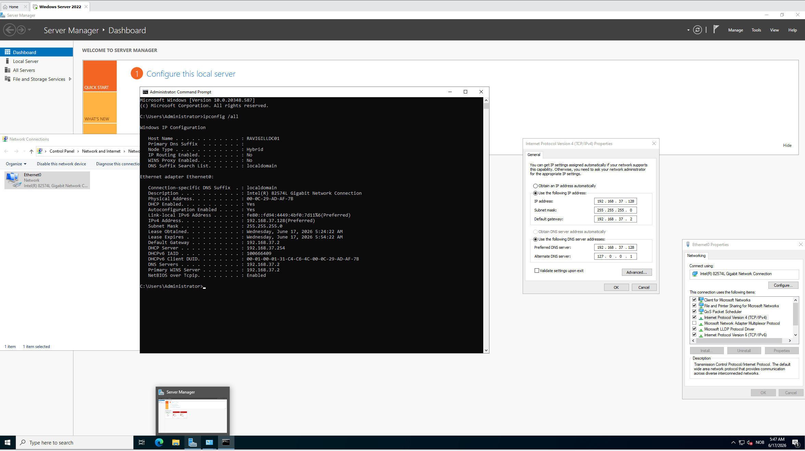

CMD showing IP after setting

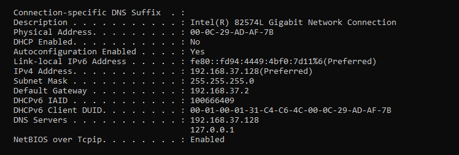

## 2. Proceeded to install the necessary features to implement AD DS on the OS using the wizard. 

Adding AD DS to OS

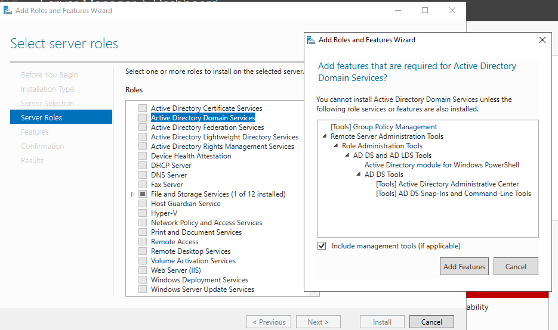

Deploying the changes to make the VM into the domain controller

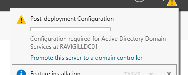

## 3. Created a user and a group named marketing, and added the user to the group. 

Creating User

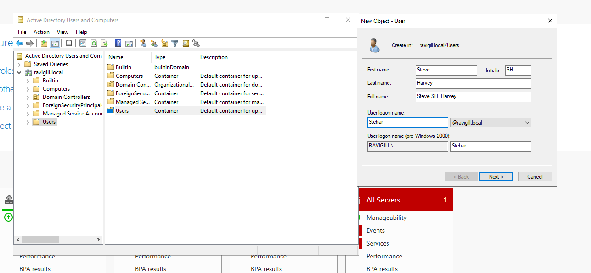

Creating Marketing group

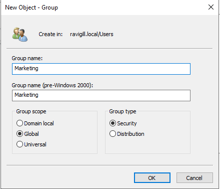

Adding the newly created user to the marketing group

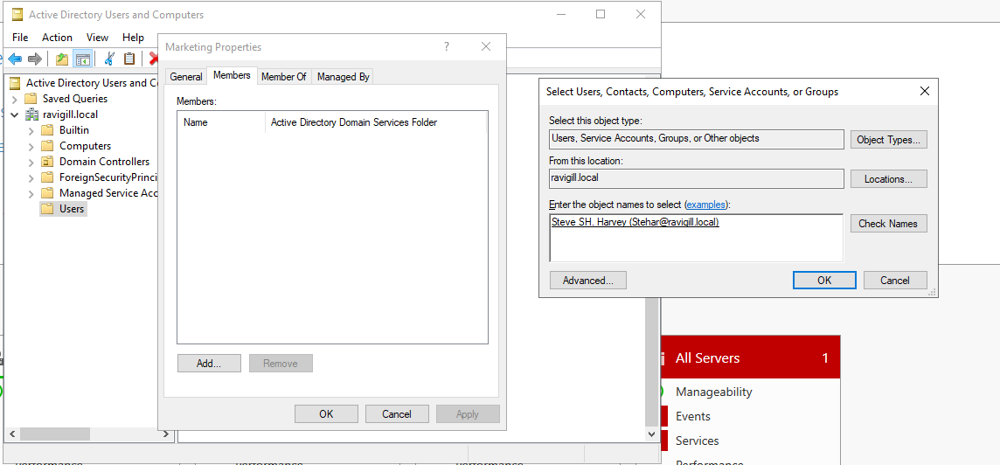

## 4. Shared a group called Marketing data on the network, and assigned permissions to the marketing group to view the contents of this folder.

Setting up file share on the Marketing data folder

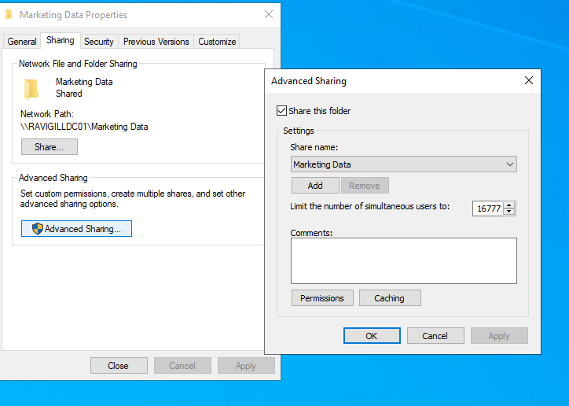

Assigning permissions to Marketing group object to view the contents of the Marketing data folder

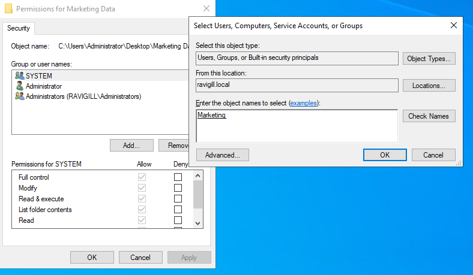

Security permissions showing the Ravigill\Marketing now has permissions to access this folder

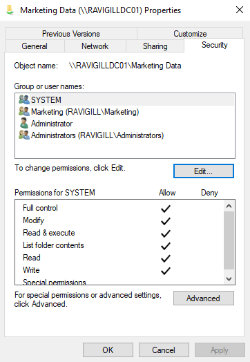

## 5. Created new Organizational units based on locations named Bergen and Oslo. Also created child organizational units for both locations named users and computers.

### Creating First OU

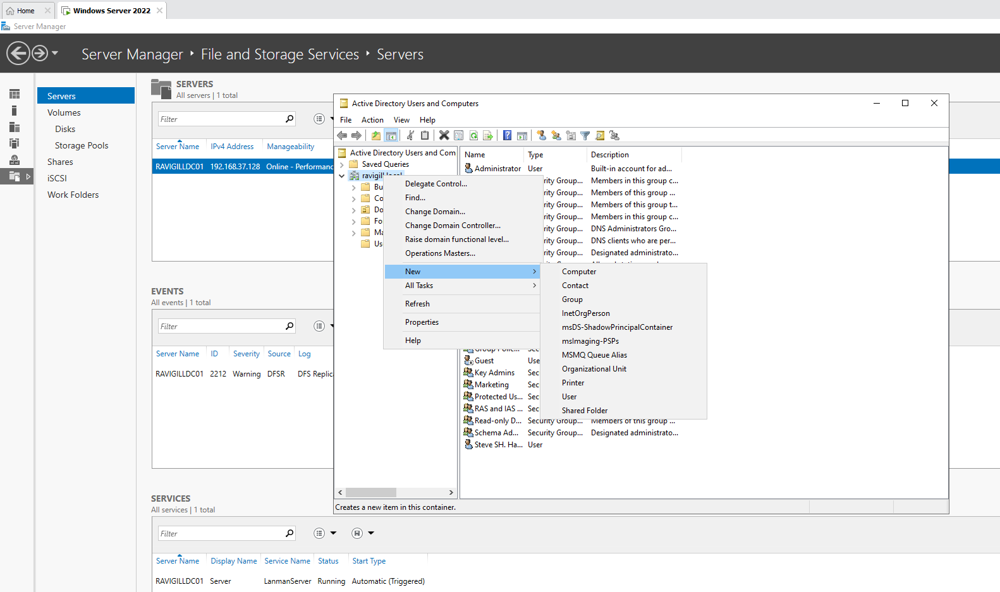

### Final heirarchy of newly created OU

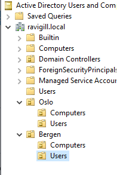

## 6. Set up a new VM with windows 11 Education and connected it to the server through the previously created domain controller. 

### Assigning DNS IP on the new client machine to point towards the domain controller

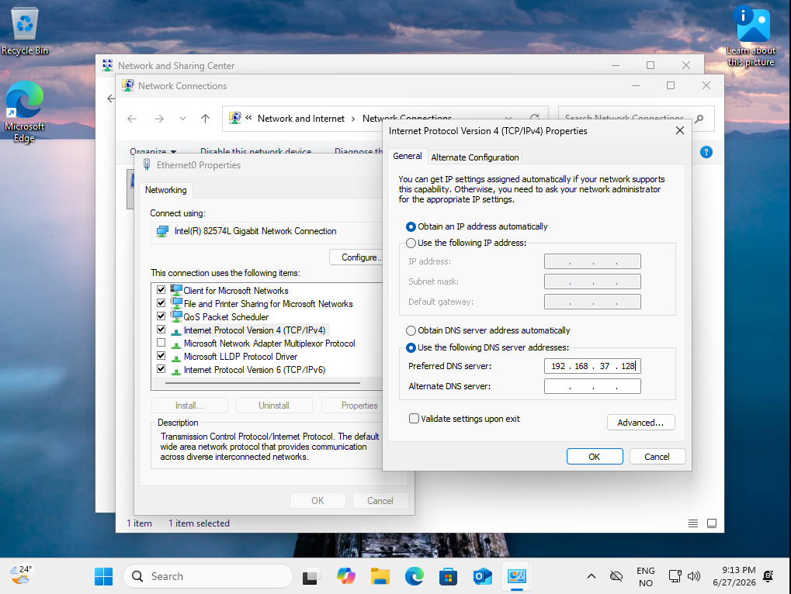

### Connecting the machine to the ravigill.local domain

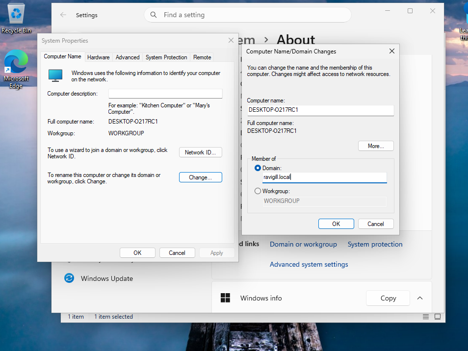

### Providing necessary credentials to connect to the domain. I used administrator, but the user created in step 3 is also possible

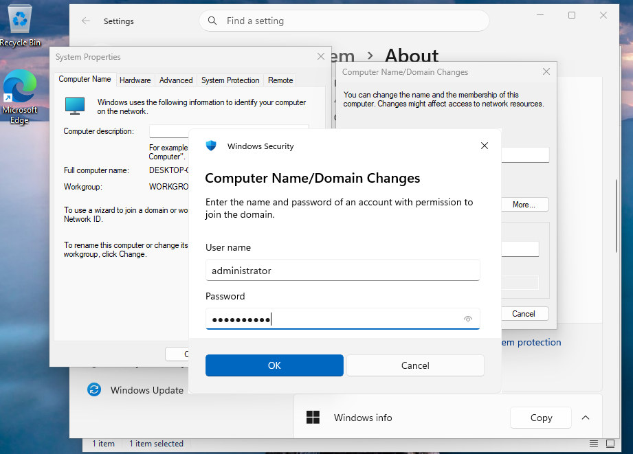

### Confirmation that the domain join was successfull

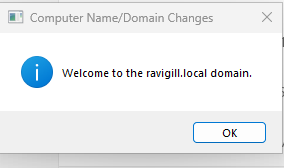

### After restarting the client VM it is now part of the domain and since i connected using the admin account it has access to the Marketing Data folder created earlier

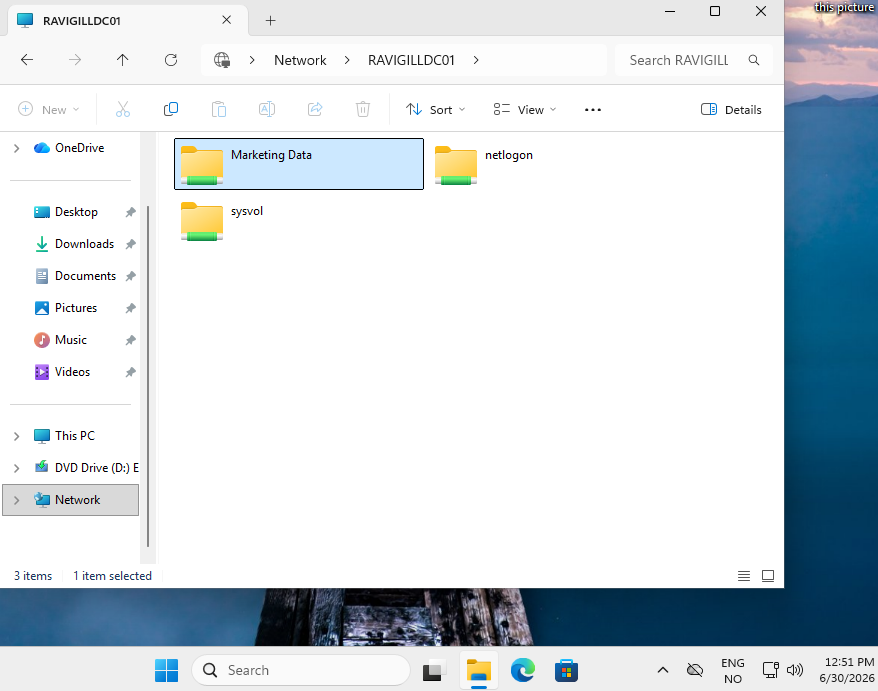

## 7. Moved the now connected Client VM to the Oslo/Computers OU for clarity and easier management

### Client VM now in the correct OU

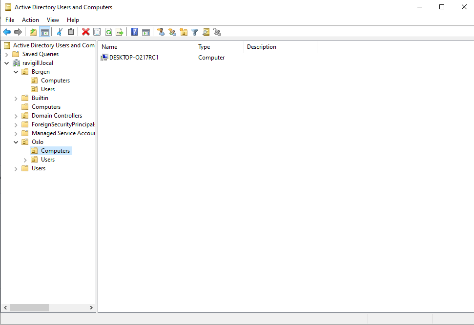

## 8. Created a GPO named Test_policy to Oslo/computers OU to force a specific default lock screen and logon image and prevent changing lock screen and logon image. 

### Choosing the policy from Group policy management Editor

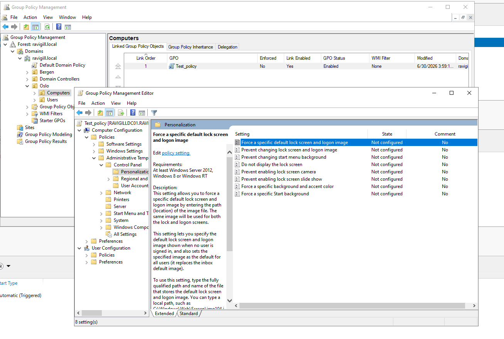

### Created a Image in Paint and the placed it in SYSVOL, then linked the path to the image in the policy rule

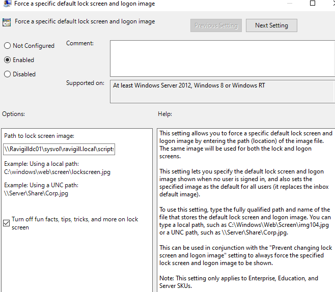

### As i was running this homelab on a low resource enviorment i could not make the image properly load, but to confirm that the policy was correctly applied i used the CMD on the cliend VM to see what the OS recognises as the lock screen image.

### CMD output for lock screen image

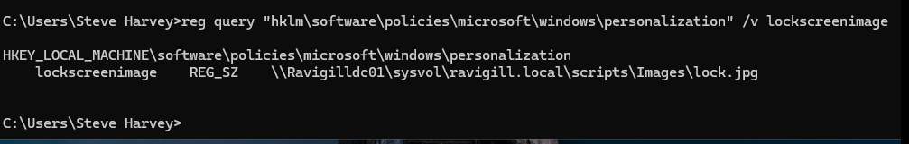

